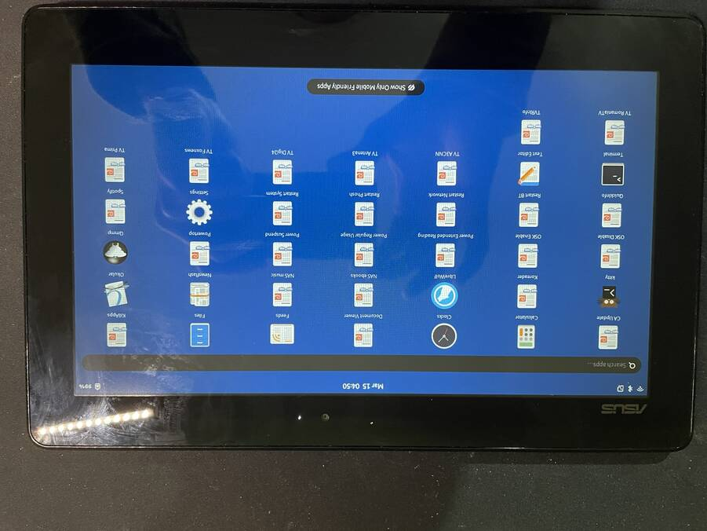
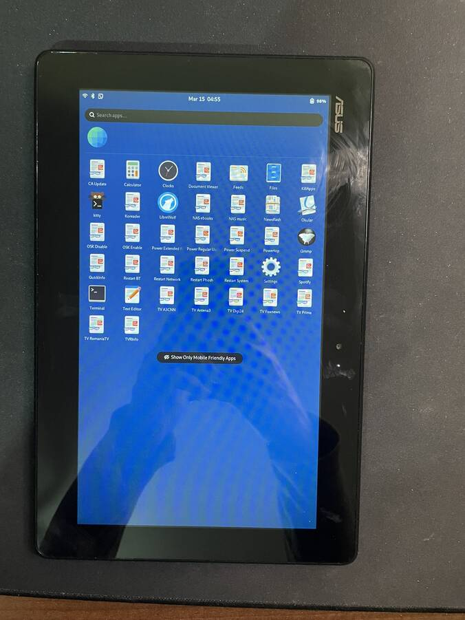
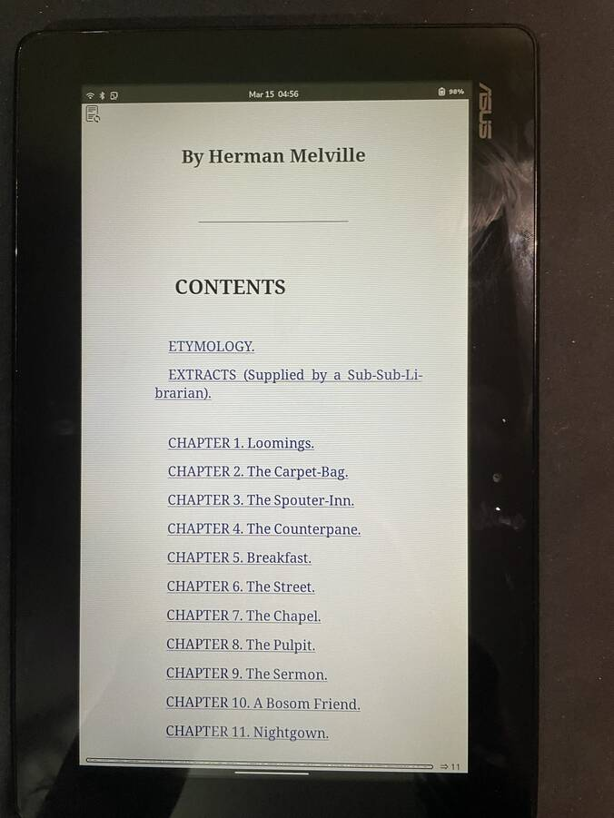
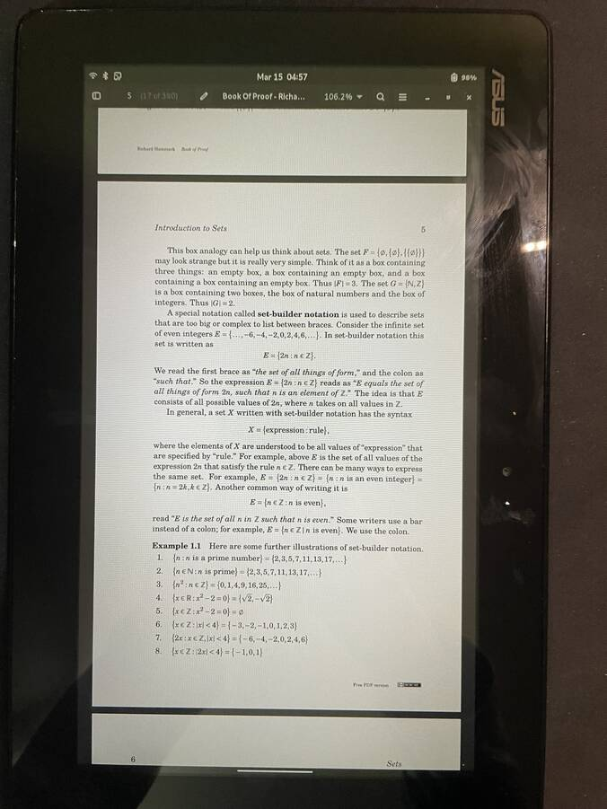
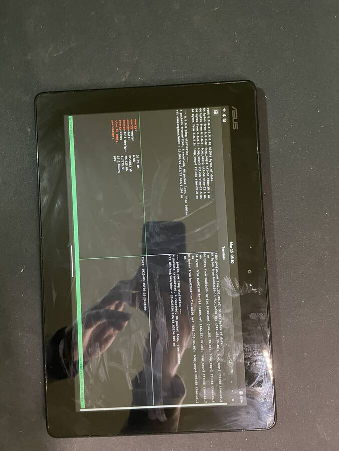
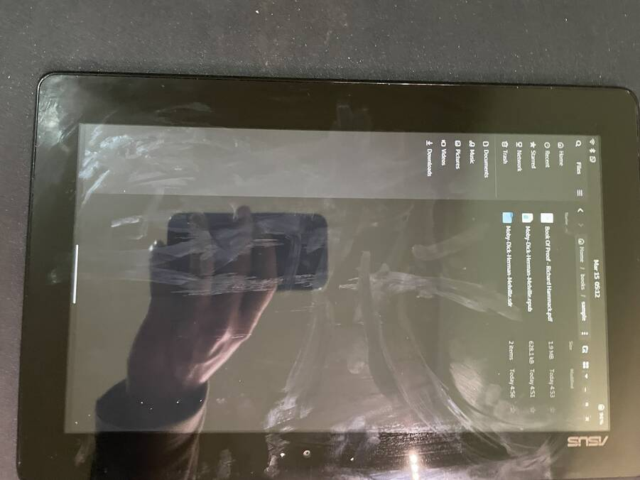

## Overview

This is an automated setup for the ASUS T100TA with Arch Linux.
I use this tablet sometimes.

## Hardware

- [Wiki page](https://en.wikipedia.org/wiki/Asus_Transformer#ASUS_Transformer_Book_T100TA_(T100TA))
- [Official specs](https://web.archive.org/web/20220813024105/https://www.asus.com/me-en/Commercial-Laptops/ASUS_Transformer_Book_T100TA/specifications/)
- [LW probe Fedora](https://linux-hardware.org/?probe=2c7298ac53)
- [LW probe Fedora](https://linux-hardware.org/?probe=34656c0496)
- [LW probe Arch](https://linux-hardware.org/?probe=22c56d2c5c)

## Network Setup

```
iwctl --passphrase <pass> station wlan0 connect-hidden <home_network_name>
```

[source](https://unix.stackexchange.com/a/664671/484783)

```
ip addr flush dev wlan0
ip link set wlan0 up
ip route add 192.168.1.1 dev wlan0
ip addr add 192.168.1.178/32 dev wlan0
ip route add default via 192.168.1.1
echo "nameserver 8.8.8.8" > /etc/resolv.conf
```

## Install

Boot from a USB with [Arch 2025-03-01](https://archive.archlinux.org/iso/2025.03.01/archlinux-2025.03.01-x86_64.iso) iso on it
([Rufus](https://github.com/pbatard/rufus/releases/tag/v4.6) works well for creating bootable USB drives).

```
archinstall
# then in chroot
pacman -S --noconfirm --needed dhclient iwd
pacman -S gnome-control-center networkmanager rsync
pacman -S --noconfirm --needed vim htop mc tmux
pacman -S --noconfirm --needed sddm phosh
```

note: During the install procedure you'll be asked to create a user. Create a user called `user`

note: Use a small digit-only password because this is a tablet and there will be a keypad on phosh
to input the password.


Grab `phosh.service`

```
wget https://gitlab.gnome.org/World/Phosh/phosh/-/raw/59f219d41dce6d89232af5398ce9e8e862f9aa63/data/phosh.service
```

Write the following in `/etc/systemd/system/phosh.service.d/override.conf`:
```
[Service]
User=user
```

SCP it to `/etc/systemd/system/phosh.service` and enable it, as well as NetworkManager and sshd

```
systemctl enable phosh
systemctl enable NetworkManager
systemctl enable sshd
```

Disable the slow and failing tpm0
```
systemctl mask dev-tpmrm0.device
```

Disable some more bloat:
```
systemctl mask tpm2
systemctl mask veritysetup
systemctl mask cryptsetup
systemctl mask veritysetup.target
systemctl mask cryptsetup.target
```

Add this line at the end of `/etc/sudoers`:
```
user ALL=(ALL) NOPASSWD: ALL
```

Get Librewolf installed, but install Yay first:
```
sudo pacman -S --needed git base-devel
git clone https://aur.archlinux.org/yay.git
cd yay
makepkg -si
```

Install librewolf:

```
yay -s librewolf-bin
```

## Running Ansible playbooks

```
ansible-playbook -i inventory 1.yml
ansible-playbook -i inventory 2.yml
ansible-playbook -i inventory 3.yml
ansible-playbook -i inventory 4.yml
```

## Syncing books

```
ansible-playbook -i inventory sync-books.yml
```

## Tests

Was tested with the Arch Rolling from 2025-03-01 with kernel 6.13.6
The camera and the image sensor still do not work.

## Images









